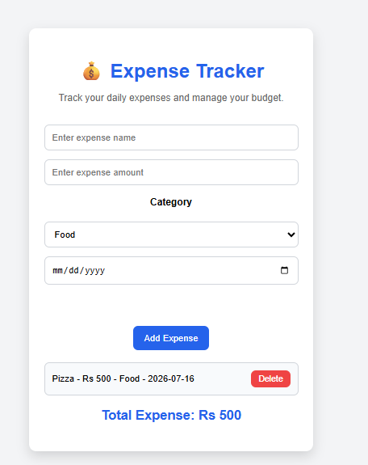

#  Expense Tracker

A simple and responsive Expense Tracker built using HTML, CSS, and JavaScript. It allows users to record daily expenses, categorize them, and stores all data in Local Storage so expenses remain available after refreshing the page.

##  Features

-  Add new expenses
-  Delete expenses
-  Expense categories
- Date selection
- Automatic total expense calculation
-  Data stored using Local Storage
-  Input validation
-  Responsive design

##  Technologies Used

- HTML5
- CSS3
- JavaScript (ES6)


##  How to Run

1. Clone the repository

```bash
git clone https://github.com/sam123227/expense-tracker.git
```

2. Open the project folder

```bash
cd expense-tracker
```

3. Open `index.html` in your browser.

##  Screenshot



##  Live Demo

https://expense-tracker-app-knq5.vercel.app


